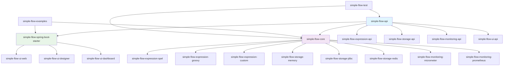
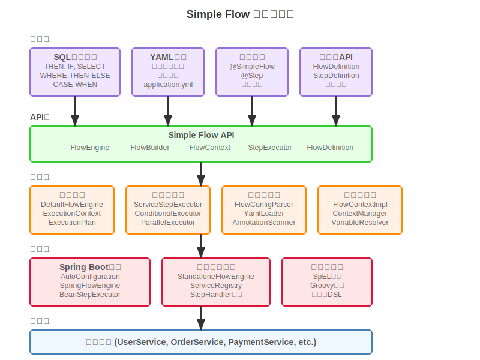
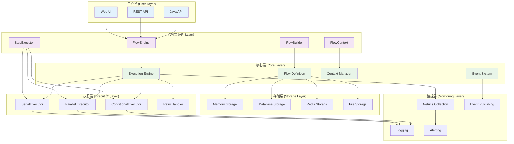
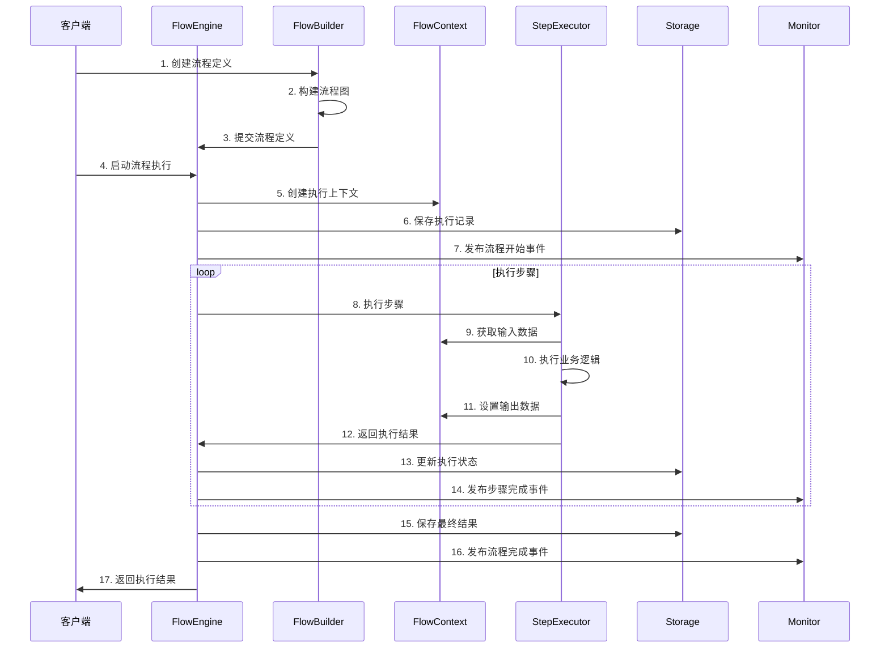
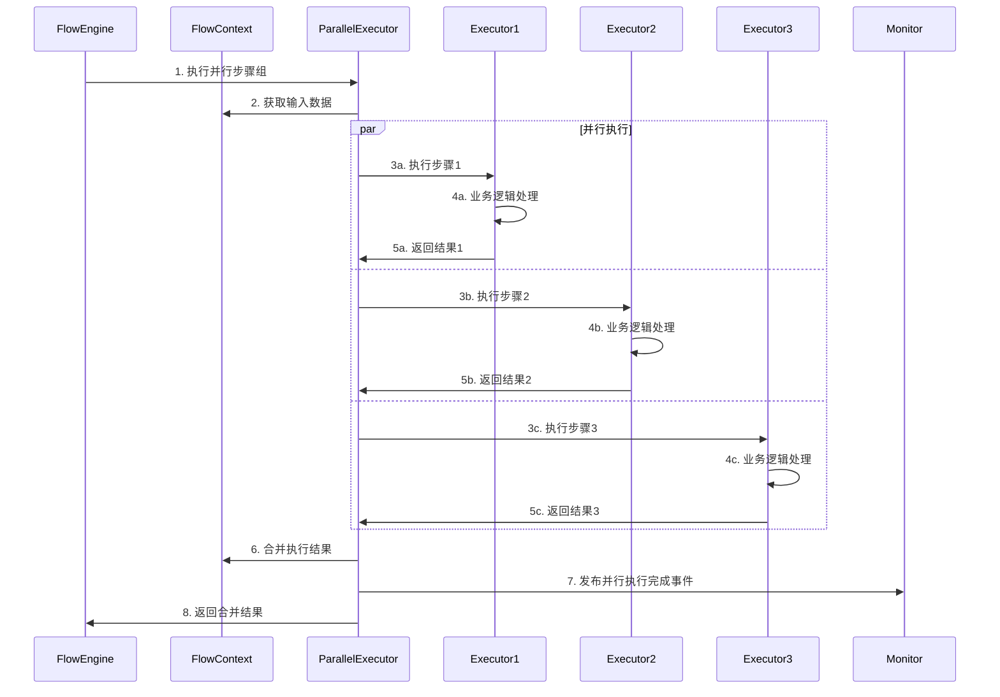
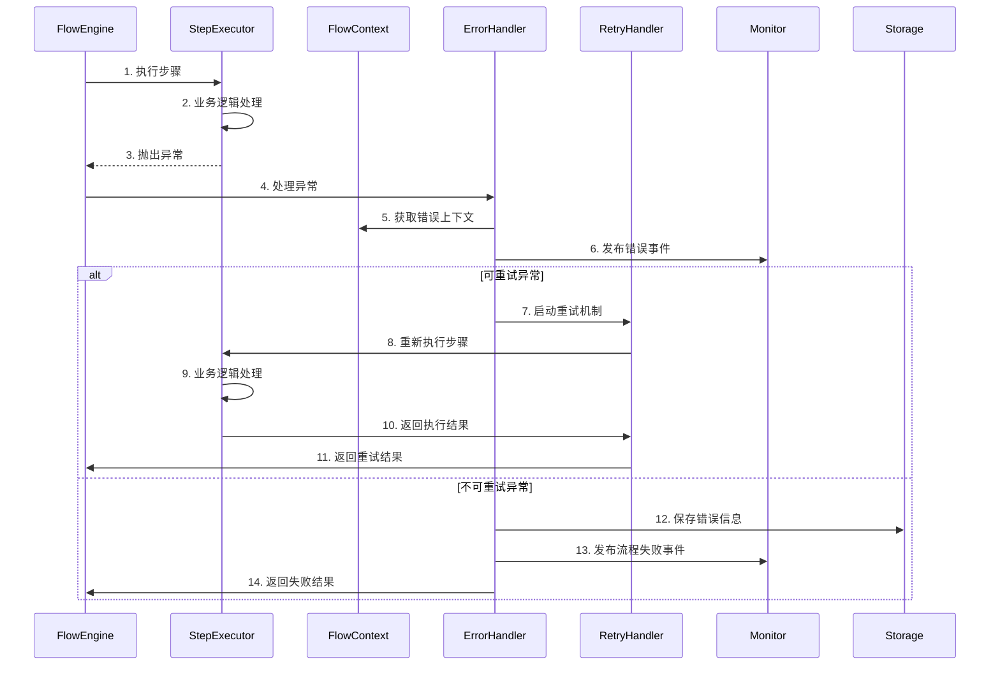
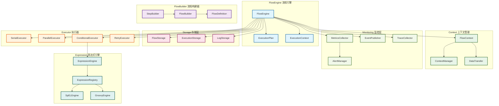
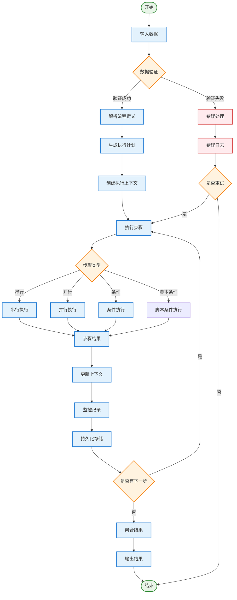
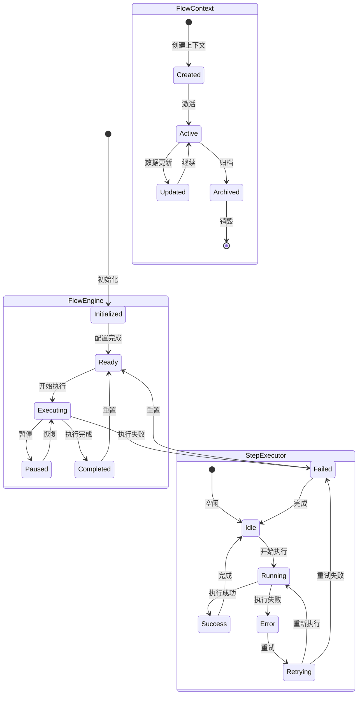

# Simple Flow 架构设计文档

## 概述

Simple Flow 是一个轻量级、易用的流程编排框架，采用分层架构设计，专为简化复杂业务流程而设计。框架支持多种配置方式，包括SQL风格语法、YAML配置、注解和编程式API，提供了丰富的执行模式和灵活的集成方案。本文档详细描述了框架的整体架构、核心组件和执行流程。

## 目录

- [1. 项目结构](#1-项目结构)
- [2. 整体架构图](#2-整体架构图)
- [3. 架构分层说明](#3-架构分层说明)
- [4. Maven模块化设计](#4-maven模块化设计)
- [5. 配置方式架构](#5-配置方式架构)
- [6. 流程执行流程图](#6-流程执行流程图)
- [7. 核心组件交互图](#7-核心组件交互图)
- [8. 数据流图](#8-数据流图)
- [9. 核心类设计](#9-核心类设计)
- [10. 设计原则](#10-设计原则)
- [11. 扩展点](#11-扩展点)
- [12. 性能考虑](#12-性能考虑)
- [13. 安全考虑](#13-安全考虑)

## 1. 项目结构

### 1.1 完整目录结构

```
simple-flow/
├── pom.xml                                    # 父POM配置
├── README.md                                  # 项目说明文档
├── LICENSE                                    # 开源协议
├── .gitignore                                 # Git忽略配置
├── docs/                                      # 文档目录
│   ├── ARCHITECTURE.md                       # 架构设计文档
│   ├── API_DESIGN.md                         # API设计文档
│   ├── CONTRIBUTING.md                       # 贡献指南
│   ├── DEPLOYMENT.md                         # 部署指南
│   └── examples/                             # 示例文档
│       ├── basic-usage.md                    # 基础使用示例
│       ├── advanced-features.md              # 高级功能示例
│       └── integration-guide.md              # 集成指南
├── scripts/                                   # 构建和部署脚本
│   ├── build.sh                             # 构建脚本
│   ├── deploy.sh                            # 部署脚本
│   └── docker/                              # Docker相关文件
│       ├── Dockerfile                        # Docker镜像构建文件
│       └── docker-compose.yml               # Docker编排文件
├── simple-flow-api/                          # API定义模块
│   ├── pom.xml
│   └── src/
│       └── main/
│           └── java/
│               └── com/simpleflow/api/
│                   ├── FlowEngine.java      # 流程引擎接口
│                   ├── FlowBuilder.java     # 流程构建器接口
│                   ├── FlowContext.java     # 流程上下文接口
│                   ├── StepExecutor.java    # 步骤执行器接口
│                   ├── model/               # 数据模型
│                   │   ├── FlowDefinition.java
│                   │   ├── StepDefinition.java
│                   │   ├── FlowResult.java
│                   │   └── StepResult.java
│                   └── exception/           # 异常定义
│                       ├── FlowException.java
│                       ├── StepException.java
│                       └── ValidationException.java
├── simple-flow-core/                         # 核心实现模块
│   ├── pom.xml
│   └── src/
│       ├── main/
│       │   ├── java/
│       │   │   └── com/simpleflow/core/
│       │   │       ├── engine/              # 引擎实现
│       │   │       │   ├── DefaultFlowEngine.java
│       │   │       │   ├── FlowExecutionContext.java
│       │   │       │   └── ExecutionPlan.java
│       │   │       ├── builder/             # 构建器实现
│       │   │       │   ├── FlowBuilderImpl.java
│       │   │       │   └── StepBuilderImpl.java
│       │   │       ├── executor/            # 执行器实现
│       │   │       │   ├── SerialExecutor.java
│       │   │       │   ├── ParallelExecutor.java
│       │   │       │   ├── ConditionalExecutor.java
│       │   │       │   └── RetryExecutor.java
│       │   │       ├── context/             # 上下文管理
│       │   │       │   ├── FlowContextImpl.java
│       │   │       │   └── ContextManager.java
│       │   │       ├── handler/             # 处理器
│       │   │       │   ├── ErrorHandler.java
│       │   │       │   └── EventHandler.java
│       │   │       └── util/                # 工具类
│       │   │           ├── FlowUtils.java
│       │   │           └── ValidationUtils.java
│       │   └── resources/
│       │       ├── META-INF/
│       │       │   └── spring.factories     # Spring自动配置
│       │       └── application.yml          # 默认配置
│       └── test/
│           └── java/
│               └── com/simpleflow/core/
│                   ├── engine/
│                   ├── builder/
│                   └── executor/
├── simple-flow-spring-boot-starter/          # Spring Boot集成
│   ├── pom.xml
│   └── src/
│       └── main/
│           ├── java/
│           │   └── com/simpleflow/spring/
│           │       ├── autoconfigure/      # 自动配置
│           │       │   ├── SimpleFlowAutoConfiguration.java
│           │       │   ├── SimpleFlowProperties.java
│           │       │   └── ConditionalConfiguration.java
│           │       ├── annotation/         # 注解支持
│           │       │   ├── EnableSimpleFlow.java
│           │       │   ├── FlowStep.java
│           │       │   └── FlowDefinition.java
│           │       └── integration/        # Spring集成
│           │           ├── SpringFlowEngine.java
│           │           └── SpringContextProvider.java
│           └── resources/
│               └── META-INF/
│                   └── spring.factories
├── simple-flow-expression/                   # 表达式引擎模块
│   ├── simple-flow-expression-api/          # 表达式API
│   │   ├── pom.xml
│   │   └── src/
│   │       └── main/
│   │           └── java/
│   │               └── com/simpleflow/expression/
│   │                   ├── ExpressionEngine.java
│   │                   ├── ExpressionEngineRegistry.java
│   │                   ├── ExpressionContext.java
│   │                   └── exception/
│   │                       ├── ExpressionException.java
│   │                       └── ExpressionValidationException.java
│   ├── simple-flow-expression-spel/         # SpEL实现
│   │   ├── pom.xml
│   │   └── src/
│   │       └── main/
│   │           └── java/
│   │               └── com/simpleflow/expression/spel/
│   │                   ├── SpELExpressionEngine.java
│   │                   ├── SpELConfiguration.java
│   │                   └── SpELFunctionRegistry.java
│   ├── simple-flow-expression-groovy/       # Groovy实现
│   │   ├── pom.xml
│   │   └── src/
│   │       └── main/
│   │           └── java/
│   │               └── com/simpleflow/expression/groovy/
│   │                   ├── GroovyExpressionEngine.java
│   │                   └── GroovyScriptCache.java
│   └── simple-flow-expression-custom/       # 自定义DSL
│       ├── pom.xml
│       └── src/
│           └── main/
│               └── java/
│                   └── com/simpleflow/expression/custom/
│                       ├── SimpleFlowDSLEngine.java
│                       ├── DSLParser.java
│                       └── DSLTokenizer.java
├── simple-flow-storage/                      # 存储模块
│   ├── simple-flow-storage-api/             # 存储API
│   │   ├── pom.xml
│   │   └── src/
│   │       └── main/
│   │           └── java/
│   │               └── com/simpleflow/storage/
│   │                   ├── FlowStorage.java
│   │                   ├── ExecutionStorage.java
│   │                   ├── LogStorage.java
│   │                   └── model/
│   │                       ├── StoredFlow.java
│   │                       ├── StoredExecution.java
│   │                       └── StoredLog.java
│   ├── simple-flow-storage-memory/          # 内存存储
│   │   ├── pom.xml
│   │   └── src/
│   │       └── main/
│   │           └── java/
│   │               └── com/simpleflow/storage/memory/
│   │                   ├── MemoryFlowStorage.java
│   │                   ├── MemoryExecutionStorage.java
│   │                   └── MemoryLogStorage.java
│   ├── simple-flow-storage-jdbc/            # JDBC存储
│   │   ├── pom.xml
│   │   └── src/
│   │       ├── main/
│   │       │   ├── java/
│   │       │   │   └── com/simpleflow/storage/jdbc/
│   │       │   │       ├── JdbcFlowStorage.java
│   │       │   │       ├── JdbcExecutionStorage.java
│   │       │   │       ├── JdbcLogStorage.java
│   │       │   │       └── mapper/
│   │       │   │           ├── FlowMapper.java
│   │       │   │           ├── ExecutionMapper.java
│   │       │   │           └── LogMapper.java
│   │       │   └── resources/
│   │       │       └── sql/
│   │       │           ├── schema.sql       # 数据库表结构
│   │       │           └── migration/       # 数据库迁移脚本
│   │       │               ├── V1__Initial_schema.sql
│   │       │               └── V2__Add_indexes.sql
│   │       └── test/
│   │           └── resources/
│   │               └── application-test.yml
│   └── simple-flow-storage-redis/           # Redis存储
│       ├── pom.xml
│       └── src/
│           └── main/
│               └── java/
│                   └── com/simpleflow/storage/redis/
│                       ├── RedisFlowStorage.java
│                       ├── RedisExecutionStorage.java
│                       ├── RedisLogStorage.java
│                       └── RedisConfiguration.java
├── simple-flow-monitoring/                   # 监控模块
│   ├── simple-flow-monitoring-api/          # 监控API
│   │   ├── pom.xml
│   │   └── src/
│   │       └── main/
│   │           └── java/
│   │               └── com/simpleflow/monitoring/
│   │                   ├── MetricsCollector.java
│   │                   ├── EventPublisher.java
│   │                   ├── TraceCollector.java
│   │                   ├── AlertManager.java
│   │                   ├── model/
│   │                   │   ├── FlowMetrics.java
│   │                   │   ├── StepMetrics.java
│   │                   │   ├── FlowEvent.java
│   │                   │   └── AlertRule.java
│   │                   └── event/
│   │                       ├── FlowStartedEvent.java
│   │                       ├── FlowCompletedEvent.java
│   │                       ├── FlowFailedEvent.java
│   │                       └── StepExecutedEvent.java
│   ├── simple-flow-monitoring-micrometer/   # Micrometer集成
│   │   ├── pom.xml
│   │   └── src/
│   │       └── main/
│   │           └── java/
│   │               └── com/simpleflow/monitoring/micrometer/
│   │                   ├── MicrometerMetricsCollector.java
│   │                   ├── MicrometerConfiguration.java
│   │                   └── MicrometerEventPublisher.java
│   └── simple-flow-monitoring-prometheus/   # Prometheus集成
│       ├── pom.xml
│       └── src/
│           └── main/
│               ├── java/
│               │   └── com/simpleflow/monitoring/prometheus/
│               │       ├── PrometheusMetricsCollector.java
│               │       ├── PrometheusConfiguration.java
│               │       └── PrometheusExporter.java
│               └── resources/
│                   └── prometheus/
│                       ├── rules.yml        # Prometheus告警规则
│                       └── dashboard.json   # Grafana仪表板配置
├── simple-flow-ui/                          # UI模块
│   ├── simple-flow-ui-api/                  # UI后端API
│   │   ├── pom.xml
│   │   └── src/
│   │       └── main/
│   │           └── java/
│   │               └── com/simpleflow/ui/api/
│   │                   ├── controller/     # REST控制器
│   │                   │   ├── FlowController.java
│   │                   │   ├── ExecutionController.java
│   │                   │   ├── MonitoringController.java
│   │                   │   └── DesignerController.java
│   │                   ├── dto/             # 数据传输对象
│   │                   │   ├── FlowDefinitionDTO.java
│   │                   │   ├── FlowExecutionDTO.java
│   │                   │   ├── ExecutionLogDTO.java
│   │                   │   └── MetricsDTO.java
│   │                   ├── service/         # 业务服务
│   │                   │   ├── FlowService.java
│   │                   │   ├── ExecutionService.java
│   │                   │   └── MonitoringService.java
│   │                   └── config/          # 配置类
│   │                       ├── WebConfig.java
│   │                       └── SecurityConfig.java
│   ├── simple-flow-ui-web/                  # Web前端实现
│   │   ├── pom.xml
│   │   ├── package.json
│   │   ├── webpack.config.js
│   │   └── src/
│   │       ├── main/
│   │       │   ├── webapp/
│   │       │   │   ├── index.html
│   │       │   │   ├── static/
│   │       │   │   │   ├── css/
│   │       │   │   │   ├── js/
│   │       │   │   │   └── images/
│   │       │   │   └── WEB-INF/
│   │       │   │       └── web.xml
│   │       │   └── frontend/                # React前端源码
│   │       │       ├── src/
│   │       │       │   ├── components/     # React组件
│   │       │       │   │   ├── common/     # 通用组件
│   │       │       │   │   ├── flow/       # 流程相关组件
│   │       │       │   │   ├── execution/  # 执行相关组件
│   │       │       │   │   └── monitoring/ # 监控相关组件
│   │       │       │   ├── pages/          # 页面组件
│   │       │       │   │   ├── FlowList.jsx
│   │       │       │   │   ├── FlowDesigner.jsx
│   │       │       │   │   ├── ExecutionHistory.jsx
│   │       │       │   │   └── Dashboard.jsx
│   │       │       │   ├── services/       # API服务
│   │       │       │   │   ├── flowApi.js
│   │       │       │   │   ├── executionApi.js
│   │       │       │   │   └── monitoringApi.js
│   │       │       │   ├── utils/          # 工具函数
│   │       │       │   │   ├── constants.js
│   │       │       │   │   └── helpers.js
│   │       │       │   ├── styles/         # 样式文件
│   │       │       │   │   ├── global.css
│   │       │       │   │   └── components/
│   │       │       │   ├── App.jsx         # 主应用组件
│   │       │       │   └── index.js        # 入口文件
│   │       │       ├── public/
│   │       │       │   ├── index.html
│   │       │       │   └── favicon.ico
│   │       │       ├── package.json
│   │       │       └── .babelrc
│   │       └── test/
│   │           └── javascript/
│   │               └── components/
│   ├── simple-flow-ui-designer/             # 流程设计器
│   │   ├── pom.xml
│   │   ├── package.json
│   │   └── src/
│   │       └── main/
│   │           └── frontend/
│   │               ├── src/
│   │               │   ├── components/
│   │               │   │   ├── designer/   # 设计器核心组件
│   │               │   │   │   ├── FlowCanvas.jsx
│   │               │   │   │   ├── NodePalette.jsx
│   │               │   │   │   ├── PropertyPanel.jsx
│   │               │   │   │   └── Toolbar.jsx
│   │               │   │   ├── nodes/      # 节点组件
│   │               │   │   │   ├── StartNode.jsx
│   │               │   │   │   ├── EndNode.jsx
│   │               │   │   │   ├── TaskNode.jsx
│   │               │   │   │   ├── DecisionNode.jsx
│   │               │   │   │   └── ParallelNode.jsx
│   │               │   │   └── edges/      # 连线组件
│   │               │   │       ├── SequenceEdge.jsx
│   │               │   │       └── ConditionalEdge.jsx
│   │               │   ├── services/
│   │               │   │   ├── designerApi.js
│   │               │   │   └── validationService.js
│   │               │   ├── utils/
│   │               │   │   ├── graphUtils.js
│   │               │   │   └── exportUtils.js
│   │               │   └── Designer.jsx    # 设计器主组件
│   │               ├── package.json
│   │               └── webpack.config.js
│   └── simple-flow-ui-dashboard/            # 监控面板
│       ├── pom.xml
│       ├── package.json
│       └── src/
│           └── main/
│               └── frontend/
│                   ├── src/
│                   │   ├── components/
│                   │   │   ├── charts/     # 图表组件
│                   │   │   │   ├── LineChart.jsx
│                   │   │   │   ├── BarChart.jsx
│                   │   │   │   ├── PieChart.jsx
│                   │   │   │   └── MetricCard.jsx
│                   │   │   ├── tables/     # 表格组件
│                   │   │   │   ├── ExecutionTable.jsx
│                   │   │   │   ├── FlowTable.jsx
│                   │   │   │   └── LogTable.jsx
│                   │   │   └── filters/    # 过滤器组件
│                   │   │       ├── DateRangeFilter.jsx
│                   │   │       ├── StatusFilter.jsx
│                   │   │       └── FlowFilter.jsx
│                   │   ├── pages/
│                   │   │   ├── Overview.jsx
│                   │   │   ├── FlowMetrics.jsx
│                   │   │   ├── ExecutionHistory.jsx
│                   │   │   └── SystemHealth.jsx
│                   │   ├── services/
│                   │   │   ├── metricsApi.js
│                   │   │   └── alertApi.js
│                   │   └── Dashboard.jsx   # 面板主组件
│                   ├── package.json
│                   └── webpack.config.js
├── simple-flow-examples/                    # 示例模块
│   ├── pom.xml
│   └── src/
│       └── main/
│           └── java/
│               └── com/simpleflow/examples/
│                   ├── basic/              # 基础示例
│                   │   ├── HelloWorldFlow.java
│                   │   ├── SequentialFlow.java
│                   │   └── ConditionalFlow.java
│                   ├── advanced/           # 高级示例
│                   │   ├── ParallelFlow.java
│                   │   ├── RetryFlow.java
│                   │   ├── ExpressionFlow.java
│                   │   └── MonitoredFlow.java
│                   ├── integration/        # 集成示例
│                   │   ├── SpringBootExample.java
│                   │   ├── DatabaseExample.java
│                   │   └── WebServiceExample.java
│                   └── config/             # 配置示例
│                       ├── application-dev.yml
│                       ├── application-prod.yml
│                       └── logback-spring.xml
└── simple-flow-test/                        # 测试工具模块
    ├── pom.xml
    └── src/
        └── main/
            └── java/
                └── com/simpleflow/test/
                    ├── FlowTestRunner.java         # 流程测试运行器
                    ├── MockStepExecutor.java      # 模拟步骤执行器
                    ├── TestFlowBuilder.java       # 测试流程构建器
                    ├── assertion/                  # 断言工具
                    │   ├── FlowAssertions.java
                    │   ├── StepAssertions.java
                    │   └── MetricsAssertions.java
                    ├── fixture/                    # 测试数据
                    │   ├── TestFlowDefinitions.java
                    │   └── TestDataBuilder.java
                    └── util/                       # 测试工具
                        ├── TestUtils.java
                        └── MockDataGenerator.java
```

### 1.2 模块依赖关系



### 1.3 构建配置

#### 父POM配置示例

```xml
<?xml version="1.0" encoding="UTF-8"?>
<project xmlns="http://maven.apache.org/POM/4.0.0"
         xmlns:xsi="http://www.w3.org/2001/XMLSchema-instance"
         xsi:schemaLocation="http://maven.apache.org/POM/4.0.0 
         http://maven.apache.org/xsd/maven-4.0.0.xsd">
    <modelVersion>4.0.0</modelVersion>
    
    <groupId>com.simpleflow</groupId>
    <artifactId>simple-flow</artifactId>
    <version>1.0.0-SNAPSHOT</version>
    <packaging>pom</packaging>
    
    <name>Simple Flow Framework</name>
    <description>A lightweight workflow orchestration framework</description>
    
    <properties>
        <maven.compiler.source>8</maven.compiler.source>
        <maven.compiler.target>8</maven.compiler.target>
        <project.build.sourceEncoding>UTF-8</project.build.sourceEncoding>
        
        <!-- 版本管理 -->
        <spring.boot.version>2.7.18</spring.boot.version>
        <spring.version>5.3.30</spring.version>
        <jackson.version>2.15.3</jackson.version>
        <slf4j.version>1.7.36</slf4j.version>
        <junit.version>5.9.3</junit.version>
        <mockito.version>4.11.0</mockito.version>
    </properties>
    
    <modules>
        <module>simple-flow-api</module>
        <module>simple-flow-core</module>
        <module>simple-flow-spring-boot-starter</module>
        <module>simple-flow-expression</module>
        <module>simple-flow-storage</module>
        <module>simple-flow-monitoring</module>
        <module>simple-flow-ui</module>
        <module>simple-flow-examples</module>
        <module>simple-flow-test</module>
    </modules>
    
    <dependencyManagement>
        <dependencies>
            <!-- Spring Boot BOM -->
            <dependency>
                <groupId>org.springframework.boot</groupId>
                <artifactId>spring-boot-dependencies</artifactId>
                <version>${spring.boot.version}</version>
                <type>pom</type>
                <scope>import</scope>
            </dependency>
            
            <!-- Simple Flow 模块 -->
            <dependency>
                <groupId>com.simpleflow</groupId>
                <artifactId>simple-flow-api</artifactId>
                <version>${project.version}</version>
            </dependency>
            <dependency>
                <groupId>com.simpleflow</groupId>
                <artifactId>simple-flow-core</artifactId>
                <version>${project.version}</version>
            </dependency>
            <!-- 其他模块依赖... -->
        </dependencies>
    </dependencyManagement>
    
    <build>
        <pluginManagement>
            <plugins>
                <plugin>
                    <groupId>org.springframework.boot</groupId>
                    <artifactId>spring-boot-maven-plugin</artifactId>
                    <version>${spring.boot.version}</version>
                </plugin>
                <plugin>
                    <groupId>org.apache.maven.plugins</groupId>
                    <artifactId>maven-compiler-plugin</artifactId>
                    <version>3.11.0</version>
                    <configuration>
                        <source>8</source>
                        <target>8</target>
                    </configuration>
                </plugin>
            </plugins>
        </pluginManagement>
    </build>
</project>
```

## 2. 整体架构图

### 2.1 架构概览



### 2.2 架构说明

Simple Flow 采用分层架构设计，从上到下分为以下几层：

1. **配置层**：支持多种配置方式，包括SQL风格语法、YAML配置、注解配置和编程式API
2. **API层**：提供统一的接口定义，包括流程引擎、构建器、上下文和执行器接口
3. **核心层**：实现核心功能，包括流程引擎、步骤执行器、配置解析器和上下文管理
4. **集成层**：提供不同环境的集成支持，包括Spring Boot集成、独立应用集成和表达式引擎
5. **业务层**：用户的业务服务实现

### 2.3 Mermaid架构图



## 3. 架构分层说明

### 3.1 用户层 (User Layer)

用户层提供多种交互方式，满足不同用户的需求：

- **Web UI**: 基于React的现代化Web界面，提供流程设计、执行监控、系统管理等功能
- **REST API**: 标准的RESTful接口，支持第三方系统集成
- **Java API**: 原生Java接口，适用于Java应用程序直接集成

### 3.2 API层 (API Layer)

API层定义了框架的核心接口，确保系统的可扩展性和一致性：

- **FlowEngine**: 流程引擎接口，负责流程的执行和管理
- **FlowBuilder**: 流程构建器接口，提供流程定义的DSL
- **FlowContext**: 流程上下文接口，管理执行过程中的数据和状态
- **StepExecutor**: 步骤执行器接口，定义单个步骤的执行逻辑

### 3.3 核心层 (Core Layer)

核心层实现框架的主要业务逻辑：

- **Flow Definition**: 流程定义管理，包括流程解析、验证、存储
- **Execution Engine**: 执行引擎，协调各个执行器完成流程执行
- **Context Manager**: 上下文管理器，负责数据传递和状态管理
- **Event System**: 事件系统，支持流程执行过程中的事件发布和订阅

### 3.4 执行层 (Execution Layer)

执行层提供多种执行策略，支持不同的业务场景：

- **Serial Executor**: 串行执行器，按顺序执行步骤
- **Parallel Executor**: 并行执行器，支持步骤的并行执行
- **Conditional Executor**: 条件执行器，根据条件决定执行路径
- **Retry Handler**: 重试处理器，提供失败重试机制

### 3.5 存储层 (Storage Layer)

存储层提供多种存储选项，适应不同的部署环境：

- **Memory Storage**: 内存存储，适用于开发和测试环境
- **Database Storage**: 数据库存储，支持MySQL、PostgreSQL等关系型数据库
- **Redis Storage**: Redis存储，提供高性能的缓存和持久化
- **File Storage**: 文件存储，支持本地文件系统和分布式文件系统

### 3.6 监控层 (Monitoring Layer)

监控层提供全面的可观测性支持：

- **Metrics Collection**: 指标收集，统计流程执行的各种指标
- **Event Publishing**: 事件发布，将流程事件发送到外部系统
- **Logging**: 日志记录，详细记录流程执行过程
- **Alerting**: 告警机制，在异常情况下及时通知

## 4. Maven模块化设计

基于前面的项目结构，Simple Flow 框架采用了细粒度的模块化设计，每个模块都有明确的职责和边界。

### 4.1 核心模块

- **simple-flow-api**: 定义所有公共接口和数据模型
- **simple-flow-core**: 核心业务逻辑实现
- **simple-flow-spring-boot-starter**: Spring Boot 自动配置和集成

### 4.2 扩展模块

- **simple-flow-expression**: 表达式引擎支持（SpEL、Groovy、自定义DSL）
- **simple-flow-storage**: 多种存储实现（内存、JDBC、Redis）
- **simple-flow-monitoring**: 监控和指标收集（Micrometer、Prometheus）
- **simple-flow-ui**: 用户界面（Web UI、流程设计器、监控面板）

### 4.3 辅助模块

- **simple-flow-examples**: 使用示例和最佳实践
- **simple-flow-test**: 测试工具和断言库

### 4.4 模块设计原则

1. **单一职责**: 每个模块只负责一个特定的功能领域
2. **松耦合**: 模块间通过接口交互，减少直接依赖
3. **高内聚**: 模块内部功能紧密相关，对外提供清晰的接口
4. **可扩展**: 支持插件化扩展，便于添加新功能
5. **向后兼容**: 保持API稳定性，支持平滑升级

## 5. 配置方式架构

### 5.1 配置方式概览

Simple Flow 支持多种配置方式，每种方式都有其特定的使用场景和优势：

```
配置方式架构
├── SQL风格语法配置
│   ├── FlowConfigurationParser.java     # 解析器
│   ├── 支持语法：THEN、IF、SELECT、WHERE-THEN-ELSE、CASE-WHEN
│   ├── 混合语法支持
│   └── XML配置文件
├── YAML配置
│   ├── YamlFlowConfigurationLoader.java  # YAML加载器
│   ├── 传统步骤定义
│   ├── 条件分支配置
│   └── application.yml集成
├── 注解配置
│   ├── @SimpleFlow                      # 流程定义注解
│   ├── @Step                           # 步骤定义注解
│   ├── AnnotationFlowScanner.java       # 注解扫描器
│   └── Spring Boot自动发现
└── 编程式API
    ├── FlowDefinition.builder()         # 流程构建器
    ├── StepDefinition.serviceStep()     # 步骤构建器
    └── 运行时动态构建
```

### 5.2 SQL风格语法架构

```
SQL风格语法处理流程
┌─────────────────┐    ┌──────────────────┐    ┌─────────────────┐
│   XML配置文件    │───▶│ FlowConfiguration │───▶│   语法解析器     │
│                │    │     Parser       │    │                │
└─────────────────┘    └──────────────────┘    └─────────────────┘
                                │                        │
                                ▼                        ▼
                       ┌──────────────────┐    ┌─────────────────┐
                       │   混合语法检查    │    │   步骤类型识别   │
                       │                 │    │                │
                       └──────────────────┘    └─────────────────┘
                                │                        │
                                ▼                        ▼
                       ┌──────────────────┐    ┌─────────────────┐
                       │  StepDefinition  │    │  FlowDefinition │
                       │     生成         │    │      构建       │
                       └──────────────────┘    └─────────────────┘
```

### 5.3 执行器选择架构

```
执行器选择机制
┌─────────────────┐
│   步骤执行请求   │
└─────────┬───────┘
          │
          ▼
┌─────────────────┐    ┌──────────────────┐
│ StepExecutor    │───▶│   Bean类型检查    │
│   Registry      │    │                 │
└─────────────────┘    └─────────┬────────┘
          │                      │
          ▼                      ▼
┌─────────────────┐    ┌──────────────────┐
│ Spring环境检查   │    │ StepHandler接口  │
│                │    │     检查         │
└─────────┬───────┘    └─────────┬────────┘
          │                      │
          ▼                      ▼
┌─────────────────┐    ┌──────────────────┐
│SpringBeanStep   │    │ 直接调用execute  │
│   Executor      │    │     方法         │
└─────────┬───────┘    └──────────────────┘
          │
          ▼
┌─────────────────┐
│   反射方法调用   │
│                │
└─────────────────┘
```

### 5.4 配置优先级

1. **编程式API** - 最高优先级，运行时动态配置
2. **注解配置** - 编译时确定，Spring Boot自动发现
3. **SQL风格语法** - 配置文件定义，支持热重载
4. **YAML配置** - 传统配置方式，与Spring Boot集成

## 6. 流程执行流程图

### 5.1 基本流程执行时序



### 5.2 并行执行时序图



### 5.3 异常处理时序图



## 6. 核心组件交互图

### 6.1 组件关系图



### 6.2 数据流图



### 6.3 组件生命周期图

